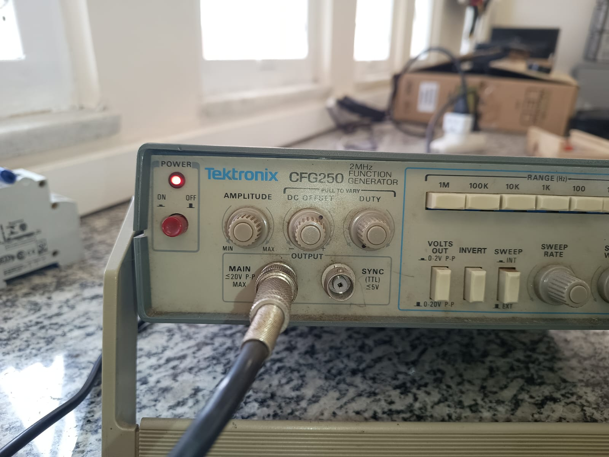
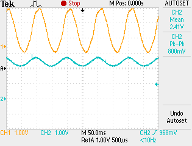

# Ensaio em frequência para o motor DC   📈
- [Start](#introducao)
- [Driver fabricação própria motor DC](#motor)
- [Driver Comercial](#new)
- [Código](#code)
- [Instrumentação](#instrument)

Tutorial sobre acionamento senoidal do motor DC. \
**O tópico 2 está desatualizado**, para acionamentos de motores DC de porte maior, é preciso utilizar o conversor BTS7960 [^5]

<!-- #######################################################1############################################################# -->
<details>
<summary id ="introducao"> <h2> <strong> 1 - Start </h2> </strong> </summary>
<hr>
Este tutorial é sobre hardware e software para acionar o motor DC para realização de ensaios. <br>
Motores BLDC podem se nortear nesse artigo mas precisam das devidas modificações (biblioteca). <br>
Para o controle de torque (nosso foco), o clássico ensaio em degrau não é adequado para inferir o modelo do sistema por isso a <strong>ênfase aqui é pela resposta em frequência</strong>. <br>
A biblioteca foco utilizada é a MCPWMesp32. Como desafio futuro, reproduzir este ensaio utilizando um microcontrolador mais robusto, preferencialmente DSP, para obter resultados mais consistentes. 
Este trabalho concluiu que: o gerador de funções senoidal de bancada apresenta algumas limitações (ajuste analógico de frequências, baixa precisão), ainda sim, é um método simples e muito eficaz.  

### Material nescessário:
**1-** ***Motor de baixa potência:***

 - Fonte de alimentação 9-12V,  
 - Driver full bridge L298N,  
 - Sensor de corrente INA 219. <br>
 
**2-** ***Motor de alta potência (500W):***

 - Fonte de alimentação 30V/5A,
 - Placa do driver IRAMS10UP, **ou** o conversor BTS7960.  
 - Sensor de corrente LEM, 
 - Fonte simétrica +-15V para o sensor. 
 
***Os demais itens são comuns para ambos ensaios:***

 - Microcontrolodor ESP32, 
 - Protoboards, 
 - Jumpers, 
 - 2x Protoboards (recomedável),
 - Jumpers, 
 - Capacitores e resistores diversos para filtragem.</li>
 - Osciloscópio de bancada, </li>
 - Gerador de sinais de bancada 


<figure>
    
</figure> 

*Figura 1- Diagrama de blocos geral do sistema.*

 <!-- #################################################################################################################### -->
 </details>

<details>
<summary id="motor"> <h2> <strong> 2 - Driver Fabricação Própria Para o motor </strong> </h2> </summary>
<hr>
 
O motor DC de 500W requer cuidados especiais, pois as tensões em 127V podem ocasionar acidentes. A base funcional para este sistema será a da Figura 1, o driver utilizado é do tipo Chopper classe E [^1] e a placa de sensoriamento é baseada no sensor LEM la55p [^2]. 

Para o prosseguimento deste ensaio é fortemente recomendado o estudo sobre o driver de acionamento do módulo IRAMS10UP60A, que se encontra publicado em uma pasta no drive da Equipe Capivara de projetos no software Altium.   
<figure>
    
</figure>

*Figura 2-Driver de acionamento do módulo IRAMS10UP60A.*

Em linhas gerais, o C.I. IRAMS é um conversor CC-CA trifásico (para o motor BLDC) que pode ser utilizado de maneira monofásica para o motor DC. Para nosso driver trabalhar utilizando apenas duas fases, é nescessário escolher qualquer uma delas para ficar ignorada. Para fins deste tutorial, vamos optar por retirar a fase C (detalhe na Figura 2). 

<figure>
    
</figure>

*Figura 3 -O mesmo detalhe contrutivo da Figura 2, porém enfatizando as montagens para a "retirada" de umas das fases.*

 Deste ponto em diante, é fortemente recomendado o estudo cauteloso do datasheet IRAMS[^3] para se acostumar com as nomenclaturas e simbologias. Durante o estudo do projeto em Altium e do manual do C.I, podem ser vistas sobrecargas e complicações de nomenclaturas.
<figure>
    
</figure>

*Figura 4 -Conector header e suas ligações. SGND corresponde ao circuito de sinal e GND ao de potênica*
     
A Figura 4 acima, mostra o raciocínio para ignorar uma das fases, isto é, ignorar um dos braços do conversor. <br>
Para isto, basta flutuar as entradas *HIN4* e *HIN5* do IRAMS de forma a retirar a fase C.  <br>
Para fazer a combinação de outras duas fases retirando uma, basta seguir o mesmo raciocínio.
     
<figure>
    
</figure>

*Figura 5 - Detalhe do circuito de octoacopladores do driver.*
 <!-- ################################################################2#################################################### -->
 </details>
 <details>
<summary id="new"> <h2> <strong> 3 - Driver Comercial </strong> </h2> </summary>
<hr>

O driver BTS7960 hoje é a melhor solução para o acionamento de motores DC variados, suportando uma corrente máxima de incríveis 43A. 
Este conversor Full H-Bridge possui algumas funcionalidades inclusas, como o dead time e entre outras(datasheet). 
O entendimento sobre a operação de um conversor com esta topologia é pré-requisito para este experimento. [^1]
 
 </details>
 <details>
<summary id ="code"><h2><strong>4 - Código</strong></h2></summary>
 <hr>

Utilizamos o VSCode para programação e upload, através da extensão PlatforMIO (notas aula prof. André.)[^4]. É recomendado já ter noções em PWM. <br>
Para o PWM há a opção de bibliotecas, LEDC e MCPWM. No entanto, para o tipo de motor da Seção 2, é nescessário usar MCPWM.<br>

```ruby
#include "Wire.h"
#include <Arduino.h>
#include <stdio.h>
#include "esp_system.h"
#include "esp_attr.h"
#include "driver/mcpwm.h"
#include "soc/mcpwm_reg.h"
#include "soc/mcpwm_struct.h"
#include "driver/adc.h"
#include "driver/dac.h"

/*Os quatro próximos define abaixo são relativos ao driver, ver seção 3 desta referência.*/
#define PWM_EN_L 19 
#define PWM_EN_R 18 
#define GPIO1 14  // pra IN1 do Driver
#define GPIO2 16  // pra IN2 do Driver
#define CANALDAC 25 // exportar a referência Duty-cicle para visualizarmos sua forma de onda no osciloscópio

mcpwm_config_t pwm_config;  //instancia da biblioteca
#define freq_do_PWM 20000 
```

No próximo trecho de código, a função **mc_pwm_deadtime_enable()** habilita a complementariedade entre os dois sinais gerados de PWM. Outra utilidade desta função é a possibilidade de determinar o *deadtime*(não obrigatório para o driver BTS7960, logo, os dois últimos parâmetros da função podem ser zerados). \

```ruby
void setup(){
  Serial.begin(115200); // ativa a interface de comunicação serial, usada para debug

/*O bloco abaixo configura as portas de dac e enable, respectivamente, como saída.
 digitalWrite escreve valor lógico alto nestas portas de enable (DAC não).
*/
  pinMode(CANALDAC26, OUTPUT);
  pinMode(PWM_EN_R, OUTPUT);
  pinMode(PWM_EN_L, OUTPUT);
  digitalWrite(PWM_EN_L, HIGH);
  digitalWrite(PWM_EN_R, HIGH);

  /*PWM*/
  mcpwm_gpio_init(MCPWM_UNIT_0, MCPWM0A, GPIO1);
  mcpwm_gpio_init(MCPWM_UNIT_0, MCPWM0B, GPIO2);
  pwm_config.frequency = freq_do_PWM; //acima da frequencia audivel (20kHz)
  pwm_config.counter_mode = MCPWM_UP_COUNTER;
  pwm_config.duty_mode = MCPWM_DUTY_MODE_0;

  mcpwm_init(MCPWM_UNIT_0, MCPWM_TIMER_0, &pwm_config);
  mcpwm_deadtime_enable(MCPWM_UNIT_0, MCPWM_TIMER_0, MCPWM_ACTIVE_HIGH_COMPLIMENT_MODE, 10, 10);  //Enable deadtime on PWM0A and PWM0B with red = (656)*100ns & fed = (67)*100ns on PWM0A and PWM0B generated from PWM0A}
  
 ```

O duty-cycle para esta biblioteca varia no intervalo *(0.0,100.0)* (1000 termos possíveis). 
Onde '100' equivale ao duty-cycle 1 e '50' equivale a 0,5.\
É importante lembrar que na configuração Full- Bridge, duty = 0.5 equivale ao motor parado; 0.5 >duty >= 0 e 1 >= duty > 0.5, correspondem às orientações horárias e anti-horárias.
Para operar este ensaio, um valor sugerido de referências duty-cycle seria Dmin = 0.6 até Dmáx = 0.8 (Dpp = 0.2).

<figure>
    
</figure>

*Figura 7 -Gerador de funções analógico, os potenciômetros de AMPLITUDE e OFFSET são muito sensíveis, girar suavemente.*
 ```ruby
  void loop(). 
{
  float d = analogRead(34)*0.0002442; // lê o pino 34 do ESP32 (escolhido arbritariamente) e multiplicado por 0.0002442 (onde 0.0002442 = 1/4096), 4096 é relativo aos 12 bits do ADC 

 /*Bloco comentado - para-DEBUG

 A dica é: monitorar o sinal de entrada antes de validar o código no motor. Faça isso variando a amplitude e offset no gerador de funções. CUIDADO, tensões acima de 3.3V podem queimar o ESP32. O DEBUG permitirá fazer um ajuste fino para Dmin, Dmax. 
 */
 // Serial.print(d*100);
 // Serial.print("\n");

  dacWrite(CANALDAC26, int(d *255)); // o DAC trabalha na escala 8 bits, logo multiplicar por 256 o duty
  mcpwm_set_duty(MCPWM_UNIT_0, MCPWM_TIMER_0, MCPWM_GEN_A, d*100); // já o PWM, conforme já mencionado, trabalha na escala 0 a 100, por isto a multiplicação
  delayMicroseconds(50); //(valor 50) = 50u, este valor objetiva parear a frequeência de atualização de referência com a frequência do chaveamento (freq_do_pwm)          
}
 
```

O bloco de código loop() é simples, basicamente exporta a entrada do ADC vinda do gerador de funções, via DAC e via PWM. \
Para um ensaio em frequências consistente é peciso visualizar no osciloscópio tanto o a entrada de referência, quanto o sinal DC-senoidal da corrente de saída. 

<figure>
    
</figure>

*Figura 8 -Formas de onda senoidais, em azul temos uma tensão de refrência para Dmin =0.6 e Dmax =0.8.*
 </details>
 <!-- ################################################################2#################################################### -->
<details>
 <summary id="instrument"> <h2> <strong> 5 - Sensor e bloco de condicionamento </h2> </strong> </summary>
 <hr>

O sensor utilizado aqui é o Sensor de correntes DC por efeito Hall. O modelo utilizado é o LEM La55p [^5], que suporta um valor de corrente medida de 50A. <br>
Além do sensor, temos também o filtro RC, um dos sub-blocos do sistema de condicionamento, conforme esquema: <br>

<figure>
    
</figure>

*Figura 9 - Sistema de condicionamento de sinais, visão interna dos blocos.*

O resistor Rshunt recomendado é o de 100 *Ohms*, para a fonte de tensão simétrica +-15V. (Cf. datasheet, nas referências) <br>
Filtro: os ruídos advindos do chaveamento podem se apresentar no sinal mensurado e até mesmo distorcer a forma de onda.<br>
O modelo é o passa-baixas RC, onde a frequência de canto projetada deve ser um quinto da frequência de chaveamento (segundo a literatura, em geral).<br>

Devido à configuração de fonte corrente do sensor, é preciso utilizar o seguidor de tensão para agir como buffer de tensão. <br>
Montado o seguidor de tensão (741, LM, etc), o sinal já pode ser filtrado e utilizado no ESP32. <br>
Por último vem o bloco de diodos que é o grampeador de tensão, que protegem o conversor AD de surtos de tensão.<br>

*Dica*: testar o sensor separadamente em um circuito à parte a fim de se familiarizar com a pinagem e o funcionamento. <br>
O sensor possui ganho base 100mV/A; não invasivo (alicate). <br>
É preciso também determinar o número de voltas do cabos de medição que deverão passar por dentro da janela "alicate", uma sugestão é 10 voltas. <br> 
  </details>


[^1]: Playlist curso de controle dinâmico do motor CC, prof. André Ferreira.
  [Cobre eletrônica de potência e este ensaio](https://www.youtube.com/watch?v=4GRKigwDKNM&list=PLBeyFlM_iECLmoYC23Ml1wRUqeZnK2EZT&ab_channel=LABSOLAR-UFJF)  
[^2]: Folha de dados do sensor de corrente [LEMla55P](https://www.lem.com/sites/default/files/products_datasheets/la_55-p_e.pdf).
[^3]: Folha de dados do circuito integrado [IRAMS10UP60A](http://www.irf.ru/pdf/irams10up60a.pdf). 
[^4]: Notas de aula para o curso de Laboratório de Controle, prof. André Ferreira.
