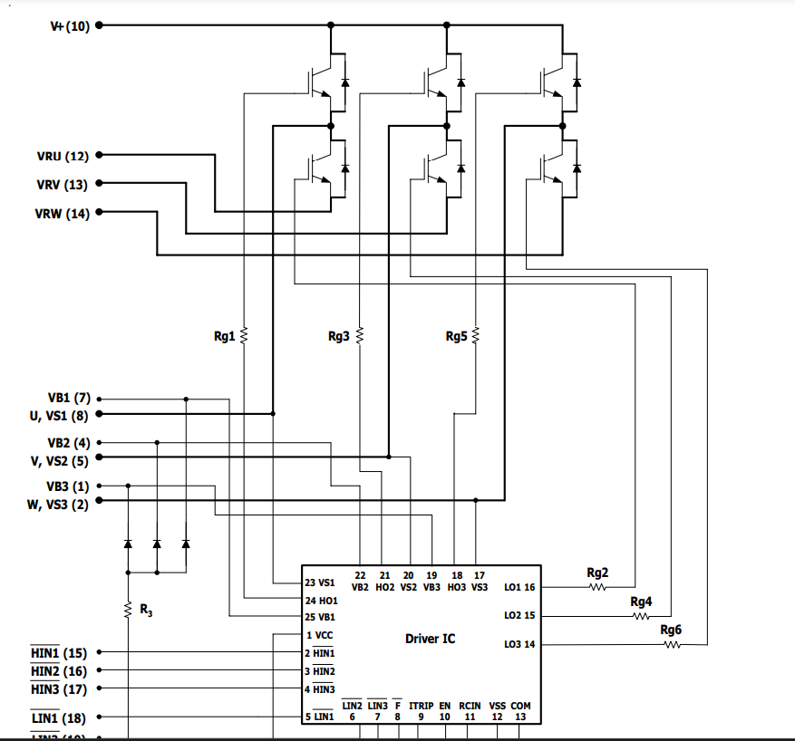
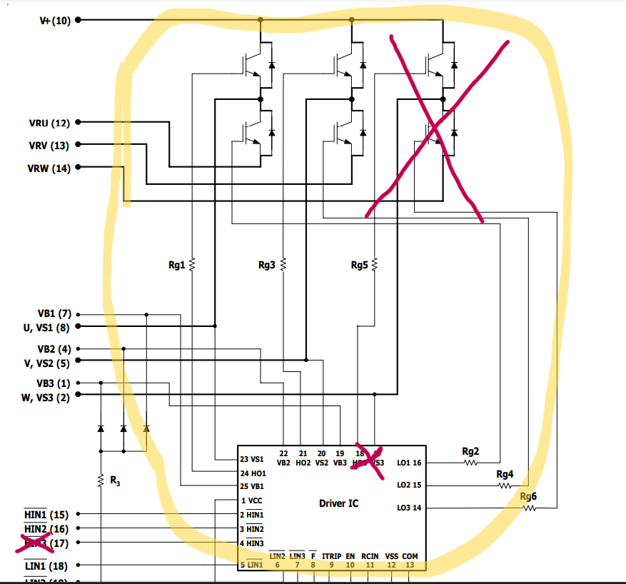
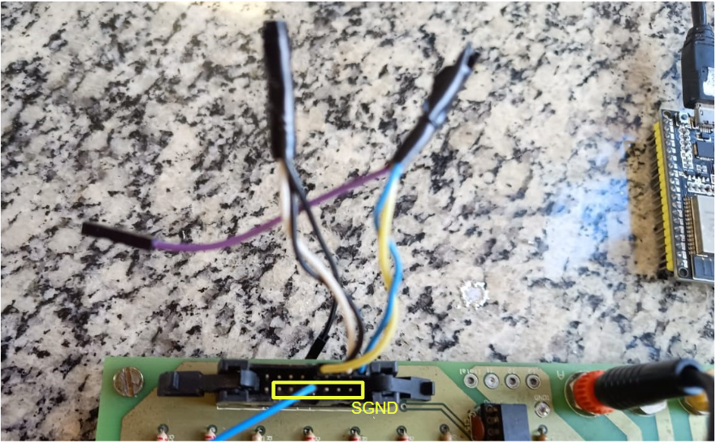
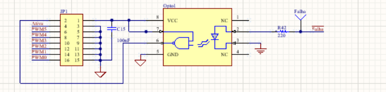

# Ensaio em frequência para o motor DC   📈
- [Kick Off](#introducao)
- [Motor 500W e o seu Driver](#motor)
- [Código](#code)
- [Instrumentação](#instrument)

<!-- #######################################################1############################################################# -->
<details>
<summary id ="introducao"> <h2> <strong> 1 - Kick Off </h2> </strong> </summary>
<hr>
Este tutorial é um resumo sobre hardware e software para acionar o motor DC de forma segura para realização de ensaios. <br>
Um dos principais pontos de projeto é o tipo de driver usado, os critérios para se decidir sobre o driver mais adequado são:

 <li> Circuito de alimentação; </li>
 <li> sensores de corrente; </li>
 <li> circuitos de proteção.</li>

Para o controle de torque (nosso foco), o clássico ensaio em degrau não é adequado para inferir o modelo do sistema por isso a ênfase é pela resposta em frequência. 

### Material nescessário:
**1-** ***Motor de baixa potência:***

 - Fonte de alimentação 9-12V,  
 - Driver full bridge L298N,  
 - Sensor de corrente INA 219. <br>
 
**2-** ***Motor de alta potência (500W):***

 - Fonte de alimentação 30V/5A,
 - Placa do driver IRAMS10UP,  
 - Sensor de corrente LEM, 
 - Fonte simétrica +-15V para o driver e sensor. 
 
***Os demais itens são comuns para ambos ensaios:***

 - Microcontrolodor ESP32, 
 - Protoboards, 
 - Jumpers, 
 - 2x Protoboards (recomedável),
 - Jumpers, 
 - Capacitores e resistores diversos para filtragem.</li>
 - Osciloscópio de bancada, </li>


<figure>
    
</figure> 

*Figura 1- Diagrama de blocos geral do sistema.*

 <!-- #################################################################################################################### -->
 </details>

<details>
<summary id="motor"> <h2> <strong> 2 - Motor 500W e o seu Driver </strong> </h2> </summary>
<hr>
 
O motor DC de 500W requer cuidados especiais, pois as tensões em 127V podem ocasionar acidentes. A base funcional para este sistema será a da Figura 1, o driver utilizado é do tipo Chopper classe E [^1] e a placa de sensoriamento é baseada no sensor LEM la55p [^2]. 

Para o prosseguimento deste ensaio é fortemente recomendado o estudo sobre o driver de acionamento do módulo IRAMS10UP60A, que se encontra publicado em uma pasta no drive da Equipe Capivara de projetos no software Altium.   
<figure>
    
</figure>

*Figura 2-Driver de acionamento do módulo IRAMS10UP60A.*

Em linhas gerais, o C.I. IRAMS é um conversor CC-CA trifásico (para o motor BLDC) que pode ser utilizado de maneira monofásica para o motor DC. Para nosso driver trabalhar utilizando apenas duas fases, é nescessário escolher qualquer uma delas para ficar ignorada. Para fins deste tutorial, vamos optar por retirar a fase C (detalhe na Figura 2). 

<figure>
    
</figure>

*Figura 3 -O mesmo detalhe contrutivo da Figura 2, porém enfatizando as montagens para a "retirada" de umas das fases.*

 Deste ponto em diante, é fortemente recomendado o estudo cauteloso do datasheet IRAMS[^3] para se acostumar com as nomenclaturas e simbologias. Durante o estudo do projeto em Altium e do manual do C.I, podem ser vistas sobrecargas e complicações de nomenclaturas.
<figure>
    
</figure>

*Figura 4 -Conector header e suas ligações. SGND corresponde ao circuito de sinal e GND ao de potênica*
     
A Figura 4 acima, mostra o raciocínio para ignorar uma das fases, isto é, ignorar um dos braços do conversor. <br>
Para isto, basta flutuar as entradas *HIN4* e *HIN5* do IRAMS de forma a retirar a fase C.  <br>
Para fazer a combinação de outras duas fases retirando uma, basta seguir o mesmo raciocínio.
     
<figure>
    
</figure>

*Figura 5 - Detalhe do circuito de octoacopladores do driver.*
 <!-- ################################################################2#################################################### -->
 </details>
 <details>
<summary id ="code"><h2><strong>3 - Código</strong></h2></summary>
 <hr>
 
O tutorial pode ser reaproveitado para diversas aplicações. No entanto, para o ensaio em frequências, de agora em diante, é recomendado prévio estudo do assunto . <br> 
Utilizamos o VSCode para programação e upload, através da extensão PlatforMIO (notas aula prof. André.)[^4]. É recomendado já ter noções em *PWM*. <br>
Para o PWM há a opção de bibliotecas, LEDC e MCPWM. No entanto, para o tipo de motor da Seção 2, é nescessário usar MCPWM.<br>

Iniando o script, temos os *#include* e *#define*. O número de sinais PWM gerados são *dois* (um complementar ao outro). <br>
Estes dois sinas complementares precisam ser montados em um socket ou conector, de modo que se ramifiquem em *quatro*, ou seja, um par semelhante vindo do *GPIO14* e o outro par semelhante vindo do *GPIO16*.<br>
A bilioteca MCPWM é a única oficial que disponibiliza geradores de sinais complementares.

```ruby
#include "Wire.h"
#include <Arduino.h>
#include <stdio.h>
#include "esp_system.h"
#include "esp_attr.h"
#include "driver/mcpwm.h"
#include "soc/mcpwm_reg.h"
#include "soc/mcpwm_struct.h"
#include "driver/adc.h"
#include "driver/dac.h"

#define CANALDAC25 25
#define GPIO1 14  // pra IN1 Ponte H
#define GPIO2 16  // pra IN2 Ponte H
#define freqStep 1 //unidade da grandeza [miliseconds]
mcpwm_config_t pwm_config;  //instancia da biblioteca 
```
Conforme mencionado, aqui será preciso o conhecimento prévio na técnica de levantamento de dados por resposta senoidal [^1].<br>
Abaixo nós temos as variáveis globais utilizadas no procedimento de geração senoidal, respectivamente, a variável índice (usada para varrer arrays) e um vetor de forma de ondas com dados pertencentes ao intervalo **(55,80)**.<br>
O vetor de referências de *duty-cycles* mantido neste intervalo garante que o motor gire somente para um lado.<br>
O vetor de forma de ondas é gerado em ambiente *python* no código ***geratable.py***. <br>
Note que a linha *#define freqStep xx* será explicada em um momento mais à frente. 

```ruby
#define LEN 50 // valor que garante uma saída com boa resolução. Compremeteria o funcionamento deste exemplo, caso seu valor fosse alterado sem suas devidas adequações.
int waveFormTB[LEN] = {67.5,69.1,70.6,72.1,73.5,74.8,76.1,77.1,78.1,78.8,79.4,79.8,80.1,80.1
,79.8,79.4,78.8,78.1,77.1,76.1,74.8,73.5,72.1,70.6,69.1,67.5,65.9,64.4
,62.9,61.5,60.2,58.9,57.9,56.9,56.2,55.6,55.2,55.0,55.0,55.2,55.6,56.2
,56.9,57.9,58.9,60.2,61.5,62.9,64.4,65.9};
int indexTB = 0;
```

Continuando o fluxo do código, temos o bloco de *setup* onde basicamente será declarado as opções do módulo PWM e demais funcionalidades.
Primeiro é aberto o módulo de comunicação serial e nas linhas subsequentes o PWM é habilitado.<br>

Os GPIOS são alocados, um para cada sinal. <br>
Os sinais podem apelidados por aqui como *a* e *b*. <br>
A função **mc_pwm_deadtime_enable()**  é quem habilita a complementariedade entre *a* e *b*. Outra grande utilidade desta função é a possibilidade de determinar o *deadtime*(não obrigatório para o driver do IRAMS, logo, os dois últimos parâmetros da função podem ser zerados).<br>
Posteriormente, é configurado o módulo conversor AD. <br>
Os argumentos passados na função são padrão e o canal utilizado *ADC1_CHANNEL_6* corresponde ao *GPIO34* do ESP32.

```ruby
void setup(){
  Serial.begin(115200);

  /*PWM*/
  mcpwm_gpio_init(MCPWM_UNIT_0, MCPWM0A, GPIO1);
  mcpwm_gpio_init(MCPWM_UNIT_0, MCPWM0B, GPIO2);
  pwm_config.frequency = 20000; //acima da frequencia audivel (20kHz)
  pwm_config.counter_mode = MCPWM_UP_COUNTER;
  pwm_config.duty_mode = MCPWM_DUTY_MODE_0;

  mcpwm_init(MCPWM_UNIT_0, MCPWM_TIMER_0, &pwm_config);
  mcpwm_deadtime_enable(MCPWM_UNIT_0, MCPWM_TIMER_0, MCPWM_ACTIVE_HIGH_COMPLIMENT_MODE, 10, 10);  //Enable deadtime on PWM0A and PWM0B with red = (656)*100ns & fed = (67)*100ns on PWM0A and PWM0B generated from PWM0A}
  
  adc1_config_channel_atten(ADC1_CHANNEL_6, ADC_ATTEN_DB_11);
  adc1_config_width(ADC_WIDTH_BIT_10);
 ```
 
 ***CÓDIGO SE ENCONTRA EM MANUTENÇÂO, por favor aguarde atualizações*** <br>
O próximo bloco é onde contém a execução dinâmica, onde são realizados: a leitura da corrente de saída do motor, exportado seu valor via DAC, e percorrido o vetor *waveFormTB*.<br>
Note que para o exemplo deste repositório, somente englobamos sinais senoidais de saída até 20*Hz*, para frequências maiores é nescessário uma pequena adaptação(uso da função delayMicroseconds).
 
A leitura é operada através do conversor AD (linha de código desatualizada requer revisão). 
 
A dinâmica de atualização do PWM envolve a dinâmica de passos de atualizações. O valor atualizado da referência *duty-cicle* é obtido de dentro de um bloco de execução que possui frequências ajustáveis (depende da frequência senoidal base desejada). <br>
O usuário deve adequar esta frequência de passo (*freqStep*) segundo a fórmula: <br>
freqStep = int(K/(freqDesejada* LEN))<br>
Importante:
- **Se** freqDesejada < 20 Hz:
  - K=1000  ( ou seja, K converte freqStep de *seconds* para *mili-seconds*).
- **Se não**:
  - K=100000 (ou seja, K converte freqStep de *seconds* para *micro-seconds*).


O *duty-cycle* para *cmpr_a* pertence ao intervalo *(0,100)* (com até uma casa decimal), onde '100' equivale ao duty-cycle 1 e '50' equivale a 0,5.<br>
Conlcuindo o tópico, o sinal PWM em seu presente passo (indexTB) é salvo na estrutura **cmpr_a**.<br>

 ```ruby
  void loop(). 
{
  //   int d = (int)(100*adc1_get_raw(ADC1_CHANNEL_6)); //linha de código em manutenção
  pwm_config.cmpr_a = waveFormTB[indexTB];     // nao e preciso atualizar o canal b, pois a biblioteca já garante que cmpr_a é o complmentar ao gerador cmpr_b
  mcpwm_init(MCPWM_UNIT_0, MCPWM_TIMER_0, &pwm_config);
  indexTB++;
  if(indexTB == LEN)
    indexTB = 0;
  delay(freqStep);          
  //delayMicroseconds(freqStep);  // para freqDesejada >20Hz, adotar esta linha de código e ignorar a linha de cima.
} 
```
 </details>
 <!-- ################################################################2#################################################### -->
<details>
 <summary id="instrument"> <h2> <strong> 4 - Sensor e bloco de condicionamento </h2> </strong> </summary>
 <hr>

O sensor utilizado aqui é o Sensor de correntes DC por efeito Hall. O modelo utilizado é o LEM La55p [^5], que suporta um valor de corrente medida de 50A. <br>
Antes de destacar o sensor, vale a pena falar sobre o *filtro RC*, um dos sub-blocos do sistema de medição, cf. figura abaixo: <br>

<figure>
    
</figure>

*Figura 6 -Sistema de condicionamento de sinais, visão interna do bloco.*

O resistor Rshunt recomendado é o de 100 *Ohms*, para a fonte de tensão simétrica +-15V. (Cf. datasheet, nas referências) <br>
Filtro: os ruídos advindos do chaveamento podem se apresentar no sinal mensurado e até mesmo distorcer a forma de onda.<br>
O modelo é o passa-baixas RC, onde a frequência de canto projetada deve ser um quinto da frequência de chaveamento (segundo a literatura, em geral).<br>

Devido à configuração de fonte corrente do sensor, é preciso utilizar o seguidor de tensão para agir como buffer de tensão. <br>
Montado o seguidor de tensão (741, LM, etc), o sinal já pode ser filtrado e utilizado no ESP32, note que o amplificador também imbute ganho extra ao sistema. <br>
Por último vem o bloco de diodos que é o grampeador de tensão, que protegem o conversor AD de surtos de tensão.<br>

*Dica*: testar o sensor separadamente em um circuito à parte a fim de se familiarizar com a pinagem e o funcionamento. <br>
O sensor possui ganho base 100mV/A; além disto, é do tipo não invasivo, nitidamente visível dadas suas características construtivas (tipo "alicate"). <br>
A ênfase aqui será de mostrar alguns cuidados práticos com o sensor, por exemplo, qual critério utilizar para determinar o número de voltas do cabos de medição que deverão passar por dentro da janela "alicate": <br> 

- **1** Estimar a corrente base do circuito de potência com auxílio do osciloscópio (sonda de corrente).
- **2** Montar o circuito da *Figura 6* 
- **3** Definir o número de voltas de cabo pela janela do sensor de modo a adequar as medições: Se a tensão de saída do *bloco* da *Figura 6* ultrapassar o limite da entrada do microcontrolador (3,3V), retire voltas.<br>
Já se a tensão entregue pelo *bloco de condicionamento* estiver com um valor insuficiente e comprometendo a precisão das medidas, incremente voltas. 
- **4** Ajuste o número de voltas, de maneira mais refinada, aprimorando os ensaios.
  </details>
 
Com isso cobrimos basicamente todos os pontos sobre o ensaio com motores DC. <br>
Mais inforações sobre SPWM e ensaio em frequência será disponibilizado neste repositório, em novas releases. <br>

[^1]: Playlist curso de controle dinâmico do motor CC, prof. André Ferreira.
  [Cobre eletrônica de potência e este ensaio](https://www.youtube.com/watch?v=4GRKigwDKNM&list=PLBeyFlM_iECLmoYC23Ml1wRUqeZnK2EZT&ab_channel=LABSOLAR-UFJF)  
[^2]: Folha de dados do sensor de corrente [LEMla55P](https://www.lem.com/sites/default/files/products_datasheets/la_55-p_e.pdf).
[^3]: Folha de dados do circuito integrado [IRAMS10UP60A](http://www.irf.ru/pdf/irams10up60a.pdf). 
[^4]: Notas de aula para o curso de Laboratório de Controle, prof. André Ferreira.
